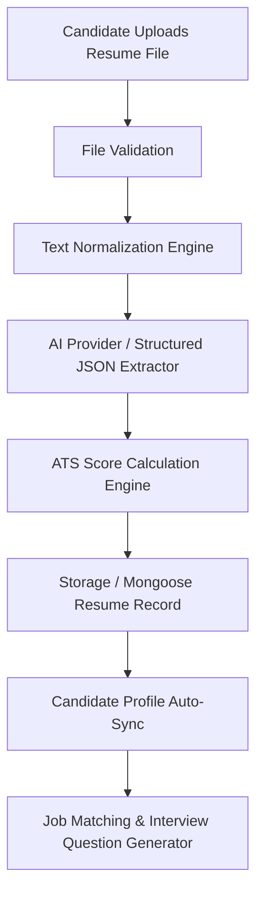
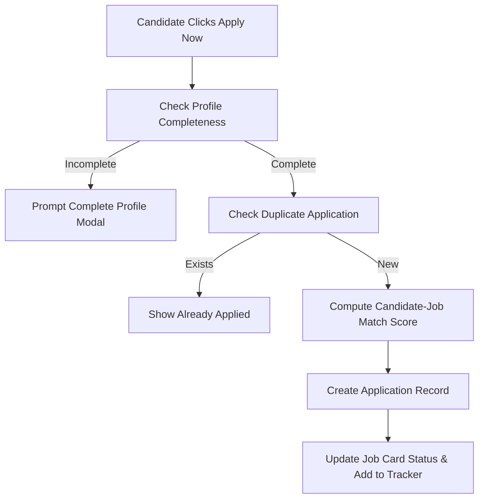

# CandidateIQ — Complete Module Architecture Audit & Master Inventory

## 1. Project Overview

CandidateIQ is an AI-driven candidate profiling, talent acquisition, and mock interview intelligence platform built using a modern MERN stack architecture. It connects candidates, recruiters, and system administrators via intelligent resume parsing, deterministic candidate-job matching, candidate-aware mock interviews, technical/behavioural evaluation analytics, and automated applicant tracking workflows.

---

## 2. Technology Architecture & Stack Audit

```text
       ┌─────────────────────────────────────────────────────────┐
       │                   REACT FRONTEND (Vite)                 │
       │  App.jsx, Components (Candidate, Recruiter, Admin, Auth)│
       └────────────────────────────┬────────────────────────────┘
                                    │
                               Axios API / REST
                                    │
       ┌────────────────────────────▼────────────────────────────┐
       │                 EXPRESS.JS BACKEND (Node.js)             │
       │     Auth, Profile, Resume, Job, Interview, Analytics    │
       └──────────────┬─────────────────────────────┬────────────┘
                      │                             │
          Mongoose ODM│                             │Gemini API / Fallback
                      ▼                             ▼
       ┌────────────────────────────┐  ┌─────────────────────────┐
       │      MONGODB DATABASE      │  │  AI PROVIDER ABSTRACTION│
       │ User, Profile, Job, App... │  │ Google Generative AI /  │
       └────────────────────────────┘  │ Deterministic Fallback  │
                                       └─────────────────────────┘
```

- **Frontend Framework**: React 18, Vite 5, React Router DOM v6
- **Styling & UI Design System**: Custom SaaS Design System (Vanilla CSS + Tailwind-compatible tokens, Glassmorphism, Outfit & Inter typography)
- **Icons & Data Visualization**: Lucide React, Recharts, XLSX spreadsheet parsing
- **Backend Framework**: Node.js, Express.js (v4.19)
- **Database & ODM**: MongoDB with Mongoose (v8.3)
- **Authentication**: JWT (JSON Web Tokens), bcryptjs password hashing, localStorage session persistence, role-based route guards
- **File Upload & Parsing**: Multer (v1.4) buffer processing, pdf-parse (v1.1) for PDF text extraction, FileReader preview for TXT/DOCX
- **AI Engine / LLM Integration**: `@google/generative-ai` (Gemini 1.5 Flash) with deterministic heuristic fallback algorithms

---

## 3. Complete Module Hierarchy Tree

```text
CandidateIQ
│
├── 01 Public & Marketing
│   └── Landing Page Module
│
├── 02 Authentication & Access Control
│   ├── User Registration & Sign Up
│   ├── User Login & Session Management
│   ├── Role-Based Access Control (RBAC)
│   └── HR Subscription & Demo Payment Gate
│
├── 03 Candidate Intelligence
│   ├── Candidate Dashboard
│   ├── Candidate Profile Hub
│   ├── Resume Parser IQ
│   ├── ATS Resume Analyzer
│   ├── Skills & Evidence Intelligence
│   └── Candidate Analytics
│
├── 04 Job Requisition & Matching
│   ├── Job Discovery & Search
│   ├── Job Details View
│   ├── Candidate Profile ↔ Job Matching Engine
│   └── Candidate Application Tracker
│
├── 05 Interview Intelligence
│   ├── AI Mock Interview Practice Room
│   ├── Recruiter Assigned Job Interview Room
│   ├── Interview Evaluation & Dynamic Reports
│   └── Interview Journey & Skill Gap Analysis
│
├── 06 Recruiter & Talent Acquisition
│   ├── Recruiter IQ Dashboard
│   ├── Recruiter Job Management (CRUD)
│   ├── Recruiter Candidate Management (Candidate Pool)
│   ├── Candidate Comparison & Matrix
│   └── AI Recruitment Assistant IQ
│
├── 07 System Administration
│   └── Admin Management Dashboard
│
└── 08 Shared Core Infrastructure
    ├── Axios API Client & Base Configuration
    ├── Database Connection & Health Monitoring
    ├── Centralized Storage & Reactive Event Bus
    ├── AI Provider Abstraction Service
    ├── File Upload & Document Parser Engine
    └── Shared UI Component Library
```

---

## 4. Module Status Summary

| Module Name | Implementation Status | Frontend | Backend | Database Schema | AI Integrated |
| :--- | :--- | :---: | :---: | :---: | :---: |
| **Landing Page** | ✅ IMPLEMENTED | Yes | N/A | N/A | No |
| **Authentication & RBAC** | ✅ IMPLEMENTED | Yes | Yes | Yes (`User`) | No |
| **Candidate Dashboard** | ✅ IMPLEMENTED | Yes | Yes | Yes (`CandidateProfile`) | Yes |
| **Candidate Profile Hub** | ✅ IMPLEMENTED | Yes | Yes | Yes (`CandidateProfile`) | Yes |
| **Resume Parser IQ & ATS** | ✅ IMPLEMENTED | Yes | Yes | Yes (`Resume`) | Yes |
| **Job Discovery & Matching** | ✅ IMPLEMENTED | Yes | Yes | Yes (`Job`, `Application`) | Yes |
| **Application Management** | ✅ IMPLEMENTED | Yes | Yes | Yes (`Application`) | No |
| **AI Mock Interview Room** | ✅ IMPLEMENTED | Yes | Yes | Yes (`Interview`) | Yes |
| **Recruiter Job Interview Room**| ✅ IMPLEMENTED | Yes | Yes | Yes (`Interview`) | Yes |
| **Interview Evaluation & Reports**| ✅ IMPLEMENTED | Yes | Yes | Yes (`Interview`) | Yes |
| **Recruiter Dashboard** | ✅ IMPLEMENTED | Yes | Yes | Yes (`Job`, `Application`) | Yes |
| **Recruiter Candidate Pool**| ✅ IMPLEMENTED | Yes | Yes | Yes (`Application`, `CandidateProfile`) | Yes |
| **Candidate Comparison** | ✅ IMPLEMENTED | Yes | Yes | Yes (`CandidateProfile`) | Yes |
| **AI Recruitment Assistant IQ**| ✅ IMPLEMENTED | Yes | Yes | N/A | Yes |
| **Admin Management** | ✅ IMPLEMENTED | Yes | Yes | Yes (`User`, `Job`, `Application`) | No |
| **Notifications Drawer** | ✅ IMPLEMENTED | Yes | Fallback | N/A | No |
| **Settings & Profile Config** | ✅ IMPLEMENTED | Yes | Yes | Yes (`User`) | No |
| **Shared Core Infrastructure** | ✅ IMPLEMENTED | Yes | Yes | Yes | Yes |

---

## 5. Database Schema Inventory

### 1. `User` Schema ([User.js](file:///d:/Mini-Project/server/models/User.js))
- **Purpose**: Central user authentication and role management.
- **Fields**:
  - `_id`: ObjectId (Primary Key)
  - `name`: String (Required, trimmed)
  - `email`: String (Required, unique, trimmed, lowercase)
  - `password`: String (Required, bcrypt hash)
  - `role`: String (Enum: `['candidate', 'hr', 'admin']`, Default: `'candidate'`)
  - `paymentStatus`: String (Enum: `['pending', 'paid']`, Default: `'paid'`)
  - `activated`: Boolean (Default: `true`)
  - `createdAt`, `updatedAt`: Date (Timestamps)

### 2. `CandidateProfile` Schema ([CandidateProfile.js](file:///d:/Mini-Project/server/models/CandidateProfile.js))
- **Purpose**: Stores structured candidate profile, skills matrix, experience, education, projects, and certifications.
- **Fields**:
  - `_id`: ObjectId
  - `user`: ObjectId (Ref: `User`, Required)
  - `userIdString`: String
  - `personalInfo`: `{ name, email, phone, location, headline, profilePhoto }`
  - `education`: `[{ degree, institution, graduationYear, cgpa }]`
  - `experience`: `[{ company, position, duration, responsibilities }]`
  - `skills`: `{ technical: [String], soft: [String], frameworks: [String], databases: [String], tools: [String] }`
  - `projects`: `[{ name, description, technologies: [String], role, url }]`
  - `certifications`: `[{ name, issuer, date }]`
  - `skillAnalysis`: `{ totalSkills: Number, confidenceScore: Number, topSkills: [String], inferredLevels: Mixed }`
  - `createdAt`, `updatedAt`: Date

### 3. `Job` Schema ([Job.js](file:///d:/Mini-Project/server/models/Job.js))
- **Purpose**: Stores job postings created by recruiters or default system requisitions.
- **Fields**:
  - `_id`: ObjectId
  - `title`: String (Required, trimmed)
  - `department`: String (Default: `'Engineering'`)
  - `description`: String (Required)
  - `requiredSkills`: `[String]` (Required)
  - `preferredSkills`: `[String]`
  - `experienceLevel`: String (Default: `'1-3 Years'`)
  - `education`: String
  - `location`: String (Default: `'Remote / Hybrid'`)
  - `employmentType`: String (Default: `'Full-time'`)
  - `status`: String (Enum: `['published', 'draft', 'closed']`, Default: `'published'`)
  - `recruiter`: ObjectId (Ref: `User`, Required)
  - `recruiterIdString`: String
  - `createdAt`, `updatedAt`: Date

### 4. `Application` Schema ([Application.js](file:///d:/Mini-Project/server/models/Application.js))
- **Purpose**: Stores candidate applications to specific job requisitions.
- **Fields**:
  - `_id`: ObjectId
  - `job`: ObjectId (Ref: `Job`, Required)
  - `jobIdString`: String
  - `candidate`: ObjectId (Ref: `User`, Required)
  - `candidateIdString`: String
  - `candidateProfile`: ObjectId (Ref: `CandidateProfile`)
  - `status`: String (Enum: `['applied', 'under_review', 'interview_scheduled', 'shortlisted', 'rejected', 'selected', 'withdrawn']`, Default: `'applied'`)
  - `matchAnalysis`: `{ overallMatch: Number, technicalMatch: Number, experienceMatch: Number, educationMatch: Number, strongMatches: [String], missingSkills: [String], explanation: String, recommendation: String }`
  - `overallScore`: Number
  - `createdAt`, `updatedAt`: Date
- **Indexes**: Compound Unique Index `(candidate + job)`

### 5. `Interview` Schema ([Interview.js](file:///d:/Mini-Project/server/models/Interview.js))
- **Purpose**: Stores mock and assigned job interview sessions, questions, responses, and evaluation reports.
- **Fields**:
  - `_id`: ObjectId
  - `candidate`: ObjectId (Ref: `User`, Required)
  - `job`: ObjectId (Ref: `Job`)
  - `title`: String
  - `type`: String (Enum: `['technical', 'behavioural', 'hr', 'final']`, Default: `'technical'`)
  - `questions`: `[{ questionId: String, category: String, question: String, targetSkill: String, candidateResponse: String, score: Number, feedback: String, behaviouralEvidence: [String] }]`
  - `overallScore`: Number
  - `scores`: `{ technical: Number, communication: Number, problemSolving: Number, depth: Number, relevance: Number }`
  - `status`: String (Enum: `['scheduled', 'in_progress', 'completed']`, Default: `'scheduled'`)
  - `evaluationReport`: `{ executiveSummary: String, keyStrengths: [String], areasForImprovement: [String], hiringRecommendation: String }`
  - `createdAt`, `updatedAt`: Date

---

## 6. Database Relationship Map

```text
               User (Auth & Roles)
                │
                ├──► CandidateProfile
                │         │
                │         ├──► Resume (Versions & Parsed Data)
                │         │
                │         ├──► Application ◄────── Job (Recruiter Requisitions)
                │         │
                │         └──► Interview (Mock & Assigned Rounds)
                │
                └──► Recruiter Jobs & Assigned Candidate Pools
```

---

## 7. Complete API Endpoint Inventory

### Authentication Routes (`/api/auth`)
- `POST /api/auth/register`: Candidate or Recruiter registration
- `POST /api/auth/login`: User authentication & JWT generation
- `GET /api/auth/me`: Fetch authenticated user profile

### Candidate Profile Routes (`/api/candidates`)
- `GET /api/candidates/profile`: Get candidate profile details
- `PUT /api/candidates/profile`: Update candidate profile, skills, experience, education

### Resume Parser Routes (`/api/resumes`)
- `POST /api/resumes/upload`: Upload resume file (PDF/DOCX/TXT) & run AI ATS parsing

### Job Requisition Routes (`/api/jobs`)
- `GET /api/jobs`: Get all published jobs (with candidate-specific metadata if authenticated)
- `POST /api/jobs`: Create new job requisition (Recruiter/Admin)
- `GET /api/jobs/:id`: Fetch single job details
- `POST /api/jobs/:id/apply`: Submit candidate job application & calculate match score
- `GET /api/jobs/:id/applicants`: Fetch candidate applications for recruiter review

### Interview Routes (`/api/interviews`)
- `POST /api/interviews/generate`: Generate personalized interview questions
- `POST /api/interviews/:id/submit`: Submit candidate answers & compute evaluation report
- `GET /api/interviews/history`: Fetch interview history for candidate

### Analytics Routes (`/api/analytics`)
- `GET /api/analytics/dashboard`: Get platform dashboard analytics metrics

---

## 8. Module Dependency Matrix

| Module | Depends On | Used By |
| :--- | :--- | :--- |
| **Authentication** | Database (`User`), JWT | Entire Platform |
| **Resume Parser IQ** | Auth, File Upload, AI Service | Candidate Profile, Job Matching, Mock Interview |
| **Candidate Profile** | Auth, Resume Parser IQ | Job Matching, Application, Recruiter Pool |
| **Job Discovery** | Auth, Job API, Application API | Candidate Dashboard, Tracker |
| **Job Matching** | Candidate Profile, Job | Job Discovery, Job Details, Mock Interview |
| **AI Mock Interview** | Job, Candidate Profile, Resume, AI Provider | Candidate Practice, Skill Gap Analysis |
| **Job Interview Room** | Interview API, Auth, Question Bank | Candidate HR & Final Rounds |
| **Interview Evaluation**| Interview API, AI Provider | Profile Review Hub, Recruiter Review |
| **Candidate Pool** | Application API, Candidate Profile | Recruiter Dashboard, Candidate Comparison |
| **Admin Management** | Auth (Admin Role), Users, Jobs, Applications | System Administrators |

---

## 9. Major Data Flows

### A. ATS Resume Parsing & Profile Auto-Sync Flow


### B. Candidate-Specific Job Application Flow


---

## 10. Technical Debt & Hardcoded Data Detection

- **Authentication Storage**: `auth.js` initializes default mock users (`cand_1`, `rec_1`, `admin_001`) in `localStorage` for fallback offline demonstration.
- **AI Key Fallback**: `aiService.js` logs warning and uses deterministic rules when `GEMINI_API_KEY` is not present in `.env`.
- **Database Fallback**: Server controllers detect MongoDB connection state via `getDBStatus()` and seamlessly route requests to in-memory array collections when MongoDB is offline.
